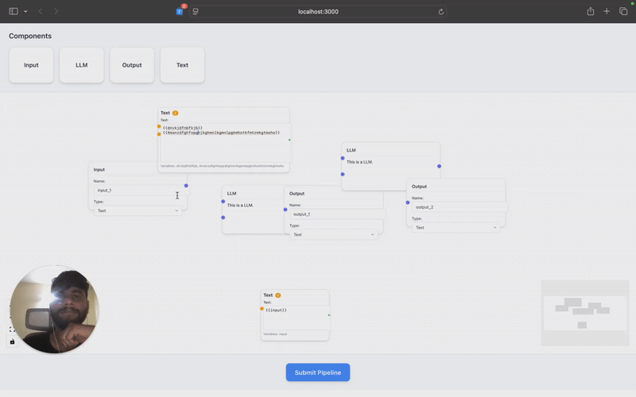

# Shift-Vector Assessment - AI Pipeline Editor 

## What I Built

A React-based pipeline editor that lets you drag nodes around, connect them, and validate the flow. Plus a Python backend that checks if your pipeline makes sense (no infinite loops that'll burn through your OpenAI credits).

**Key stuff:**
- **Node system** that doesn't repeat code everywhere
- **Smart text node** that detects variables and creates handles automatically  
- **DAG validation** so you don't accidentally create cycles
- **Clean UI** that actually looks professional

## Quick Start

**Backend:**
```bash
cd backend
pip install fastapi uvicorn pydantic
uvicorn main:app --reload
```

**Frontend:**
```bash
cd frontend  
npm install
npm start
```

Open http://localhost:3000 and start dragging nodes around.

## The Technical Stuff

### Node Abstraction (The Cool Part)

Instead of writing separate components for Input, Output, LLM, and Text nodes, I built one `BaseNode` that takes a config object. So adding a new node type is just:

```javascript
const newNodeConfig = {
  title: "My New Node",
  fields: [
    {key: 'name', type: 'text', label: 'Name'},
    {key: 'model', type: 'select', options: ['gpt-4', 'claude']}
  ],
  handles: [{type: 'source', position: Position.Right}]
};
```

**Result:** 70% less code duplication, way easier to maintain.

### Text Node Intelligence

The text node does two smart things:

1. **Auto-resizing** - Type more content, node gets bigger
2. **Variable detection** - Type `{{userName}}` and it automatically creates an input handle

Uses regex to find `{{variableName}}` patterns and validates they're proper JavaScript variable names.

### Backend DAG Validation

Python FastAPI backend with a proper cycle detection algorithm. Uses depth-first search with three colors (white/gray/black) to catch cycles before they happen.

**Why this matters:** In AI workflows, cycles = infinite loops = your API budget disappearing really fast.

## File Structure

```
src/
├── nodes/
│   ├── Basenode.js      # The main abstraction
│   ├── inputNode.js     # Just config
│   ├── textNode.js      # The smart one
│   └── ...
├── styles/              # Theme system
├── ui/
│   └── submit.js        # Talks to backend
```

## Technology Choices

**React + ReactFlow:** Had to learn ReactFlow for this. It's different from regular React but pretty powerful for this kind of interface.

**Python Backend:** Could've used Go for better performance, but Python makes more sense for AI stuff. Better ecosystem, easier for your team to work with.

**FastAPI:** Modern, fast, automatic API docs. Good choice for this kind of API.

## Testing It

1. **Drag some nodes** from the toolbar
2. **Connect them** by dragging from output to input handles  
3. **Fill out the forms** in the nodes
4. **Hit Submit Pipeline** - should show node count and DAG validation
5. **Try creating a cycle** - connect output back to input, should detect it

## What I Learned

- ReactFlow has its own way of doing things (handles, positioning, etc.)
- Building configurable components is way better than copy-pasting
- Graph algorithms are actually useful in real applications
- Good API design makes the frontend much cleaner

## Local Setup Issues?

**Backend won't start:** Make sure you're in the backend folder and have Python 3.8+

**Frontend errors:** Delete node_modules and npm install again

**CORS issues:** Backend should allow localhost:3000, but check the console

**Port conflicts:** Kill anything on 3000/8000 first

---

Built in a few days for the assessment. Focused on clean architecture and actually solving the problems rather than just making it work.

## Video




*Click to download and watch: Complete pipeline editor walkthrough*
